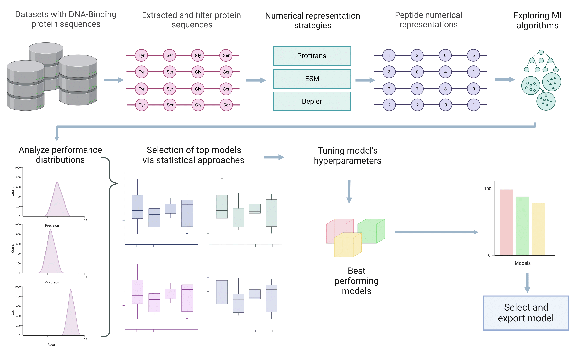

# RUDEUS, a machine learning classification system for DNA-Binding protein identification.

This repository contains the source files and supplementary information for the implementations and use cases presented in the work:

David Medina-Ortiz<sup>1,2∗</sup>, Gabriel Cabas-Mora<sup>1</sup>, Iván Moya-Barría<sup>1,3</sup>, Nicole Soto-García<sup>1</sup>, Roberto Uribe-Paredes<sup>1</sup>. <br>
RUDEUS, a machine learning classification system for DNA-Binding protein identification. <br>
[https://doi.org/10.1101/2024.02.19.580825](https://www.biorxiv.org/content/10.1101/2024.02.19.580825v1)<br>


<sup>*1*</sup><sub>Departamento de Ingeniería En Computación, Universidad de Magallanes, Avenida Bulnes 01855, Punta Arenas, Chile.</sub> <br>
<sup>*2*</sup><sub>Centre for Biotechnology and Bioengineering, CeBiB, Beauchef 851, Santiago, Chile</sub> <br>
<sup>*3*</sup><sub>Departamento de Química, Universidad de Magallanes, Av. Pdte. Manuel Bulnes 01855, Punta Arenas, Chile</sub> <br>
<sup>*\**</sup><sub>Corresponding author</sub> <br>

---
## Table of Contents
- [A summary of the proposed work](#summary)
- [Requirements](#requirements)
- [Datasets employed in this work](#datasets)
- [Training models](#training)
- [Running your pipeline](#examples)
- [References](#references)
---

<a name="xai"></a>

# RUDEUS, a machine learning classification system for DNA-Binding protein identification.

The interactions between DNA and proteins forms the basis of numerous cellular processes crucial for biological function. Approximately 6-7% of eukaryotic proteins are known to interact with DNA. These proteins posses distinctive DNA-binding domains and different affinities for both single-stranded and double-stranded DNA. The DNA-protein recognition mechanisms involve direct base–amino acid interactions and indirect contributions from conformational energy derived from DNA deformations and elasticity.

DNA-binding proteins play relevant roles in diverse biological processes, including DNA replication, transcription, DNA packaging, and chromatin remodeling. These proteins guide strand separation, aid in maintaining DNA integrity, regulate gene expression, compact genetic material, and reorganize chromatin structure. Understanding the characteristics and functions of DNA-binding proteins has become essential across various scientific disciplines. Identifying these proteins not only enhances its comprehension of structural regulations but also facilitate understanding relations between gene mutations and genetic diseases. The exploration of DNA-binding proteins, such as TDP-43, helicase chromodomain proteins, and those with methyl-CpG- binding domains, has notably contributed to recognizing pathologies like neurodegenerative disorders and cancers. 

Various approaches have been employed for DNA-binding protein recognition using ML methods, ranging from classic strategies with feature engineering to more recent implementations of deep learning architectures. Despite achieving similar performances, the comparison between methods is challenging due to variations in training datasets and validation examples. In the context of classifying single-stranded and double-stranded DNA, similar methodologies have been applied to develop predictive systems generating similar challenges, with limited exploration of physicochemical encoders and numerical representation strategies supported by large language models.

Advances in computational biology and bioinformatics has significantly facilitated the study of protein functionality, allowing for comprehensive analyses of behavior, structure, interactions, and physicochemical properties. While these computational tools have greatly supported molecular biology research, their limitations in conducting large-scale functional studies have required the integration of artificial intelligence (AI) strategies and machine learning algorithms (ML). This integration has accelerated the discovery of new DNA-binding proteins, focusing on predicting interaction sites, hotspots, and transcription factor binding sites.

This paper introduces RUDEUS, a Python library for DNA-binding classification systems and the recognition of single-stranded and double-stranded interactions. The library incorporates a generalizable pipeline that combine protein language models, supervised learning algorithms, and hyperparameter tuning guided by Bayesian approaches to train predictive models. Using this pipeline, it was trained and validated two classification systems for DNA-binding identification and single-stranded and double-stranded interaction evaluation, achieving precision rates of 95% and 89%,
respectively. RUDEUS’s usability is demonstrated through the evaluation of various DNA-binding proteins, annotating over 20,000 protein sequences, and validating it using structural bioinformatic approaches. The developed strategies, together with RUDEUS’s implementation and simplicity, not only showcase comparable performances to high-performance models but also offer enhanced usability for latent space exploration and mutational landscape navigation in the realm of DNA-
binding proteins.

<a name="requirements"></a>

## Requirements

The source code implemented in this work was written in Python language programming version 3.9. The main packages and modules are describe below:

- Python >=3.9
    - numpy
    - pandas
    - scikit-learn
    - imblearn
    - joblib
    - optuna
    - seaborn
    - matplotlib
    - vapelot
    - bio_embeddings
    - tqdm
    - lightdock
- [Reduce](https://github.com/rlabduke/reduce)

Specific versions of requirements are listed in:
- [requirements.txt](requirements.txt)

A full detail environment config document is exposed in:
- [environment.yml](environment.yml)

To emulate the generated environment you can run in the command line:

```
    conda create -n name_environment -f environment.yml
```

*NOTE*: change "name_environment" as your convenience

The datasets, raw and encoded, and selected models are located on this [One drive](https://umagcl-my.sharepoint.com/:f:/g/personal/nicole_soto_funcionarios_umag_cl/Epw3KKnLn1hHhqc6E5jKs3kBLtJ0kaRXK6B-APGU4hS5sQ?e=xSu8gw) folder. It's mandatory to download it if you want to reproduce this work using available notebooks. 

<a name="datasets"></a>

## Datasets

In this work, we used two datasets available in literature for training the classification models generated in the use cases. The datasets are described below:

### DNA binding proteins

Dataset with protein sequences classified as a DNA-Binding protein (20518 examples) and non-DNA-Binding protein (26982 examples). The dataset was generated collecting the information in [[1, 2]](#dm_cite).


### Single/Double stranded DNA binding proteins

Dataset with protein sequences classified as a DNA single stranded binding protein (268 examples) and DNA double stranded binding protein (965 examples). The dataset was generated collecting the information in [[3, 4]](#dm_cite).


<a name="training"></a>

## Training models

For training a predictive model using machine learning algorithm we have implemented the pipeline described in the following figure:



The pipeline to train a predictive model for protein engineering used in this work contains the following steps:

- **Prepare dataset**: Process raw data, clean, and create the input for the next step.
- **Encode dataset** : Encode raw sequences using embeddings and transformers from Bio_embeddings library.
- **Explore machine learning algorithms**: Different supervised learning algorithms are explored employed with default hyperparametes to train predictive models. To manage inbalance data, a process of random under sampling and random splitting is employed. Depending on the type of the model, different metrics are applied to evaluate the performances of the trained model. Beside, *k=5* cross-validation strategies are applied to prevent the overfitting. 
- **Select best model**: The best model is selected based on the metrics distrution obtained during the training and validation process. The filtering is done using quantiles (10), highest performance means and lower standart deviations.
- **Optimize best model hyperparameters**: The best selected model is tuned using Optuna, obtaining the best hyperparameters.
- **Export selected model**: The optimized models are exported employing the joblib library.
- **Bioinformatics validation**: For to validate our model, a docking process is included in the library using Lightdock.

<a name="examples"></a>

## Running your pipeline

For train, select and use models, please see the pipelines in [notebooks](./notebooks/) folder:

- **Nomerical representation** : [01_numerical_representation.ipynb](./notebooks/01_numerical_representation.ipynb)

- **Machine learning exploration** : [02_machine_learning_exploration.ipynb](./notebooks/02_machine_learning_exploration.ipynb)

- **Model selection** : [03_model_selection.ipynb](./notebooks/03_model_selection.ipynb)

- **Model optimization** : [04_model_optimization.ipynb](./notebooks/04_model_optimization.ipynb)

- **Use model** : [05_use_model.ipynb](./notebooks/05_use_model.ipynb)


For bioinformatics validation using docking, please see:

- **PDB preprocessing** : [06_pdb_preprocessing.ipynb](./notebooks/06_pdb_preprocessing.ipynb)

- **Docking** : [07_docking.ipynb](./notebooks/07_docking.ipynb)


<a name="references"></a>
## References

<a name="dm_cite"></a>


[1] Hu, Siquan and Ma, Ruixiong and Wang, Haiou (2019). An improved deep learning method for predicting DNA-binding proteins based on contextual features in amino acid sequences. PLoS one, 14(11):e0225317.

[2] Shadab, Shadman and Khan, Md Tawab Alam and Neezi, Nazia Afrin and Adilina, Sheikh and Shatabda, Swakkhar (2020). DeepDBP: deep neural networks for identification of DNA-binding proteins. Informatics in Medicine Unlocked, 19: 100318

[3] Sharma, Ronesh and Kumar, Shiu and Tsunoda, Tatsuhiko and Kumarevel, Thirumananseri and Sharma, Alok. (2021). Single-stranded and double-stranded DNA-binding protein prediction using HMM profiles. Analytical biochemistry, 612:113954.

[4] Wang, Wei and Sun, Lin and Zhang, Shiguang and Zhang, Hongjun and Shi, Jinling and Xu, Tianhe and Li, Keliang. (2017). Analysis and prediction of single-stranded and double-stranded DNA binding proteins based on protein sequences. BMC bioinformatics, 1-10.
